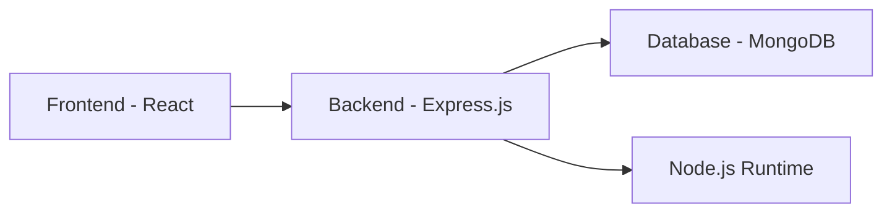

<div align="left">

<div align = "center">

# 🤖 WayMax

<h3>Your AI-Powered Career Companion</h3>

[](https://choosealicense.com/licenses/mit/)
[](https://opensource.org/)
[](http://makeapullrequest.com)

<p align="center">
  <i>"Like Baymax, but shows you the way!"</i>
</p>

[Features](#-features) •
[Tech Stack](#-tech-stack) •
[Installation](#-installation) •
[Screenshots](#-screenshots) •
[Roadmap](#-roadmap) •
[Team](#-team)

</div>

---

## 🚀 WayMax Prototype

[🔗 Click here to view the Figma prototype](https://www.figma.com/proto/LI5vYi2GLjdezYn5gWeUGV/WayMax?page-id=0%3A1&node-id=1-2&viewport=345%2C616%2C0.55&t=E1etdUw10wtXjA0Q-1&scaling=scale-down&content-scaling=fixed)

---

## 🌟 What is WayMax?

WayMax is a revolutionary open-source platform that transforms career development through the power of AI. Just as Baymax is a personal healthcare companion, WayMax serves as your dedicated career navigator, understanding your unique skills, aspirations, and learning style to forge the perfect path to professional success.

Our platform doesn't just suggest careers – it builds comprehensive, personalized roadmaps to help you get there. Using advanced AI algorithms and real-time labor market data, WayMax identifies skill gaps, recommends targeted learning resources, and adapts to your progress. Whether you're a student exploring career options, a professional looking to upskill, or someone considering a career change, WayMax provides the guidance, tools, and support you need – all completely free and open-source.

### Key Differentiators:
- **Smart Learning Paths**: Unlike traditional platforms that offer one-size-fits-all solutions, WayMax creates dynamic, personalized learning journeys that evolve with your progress
- **AI-Powered Insights**: Our advanced AI system analyzes market trends, your skills, and learning patterns to provide actionable career guidance
- **Comprehensive Support**: From skill development to job search strategies, WayMax is your all-in-one career development companion 
- **Community-Driven**: Being open-source, WayMax harnesses the power of community contributions to continuously improve and adapt to changing career landscapes

## 🎯 The Problem We Solve

Without WayMax | With WayMax
:--- | :---
❌ Misaligned Career Choices | ✅ Career Choices Based on Your Learning
❌ Difficulty in Skill Development | ✅ Fun Way of Skill Development
❌ Ineffective Job Searching | ✅ Job Searches Made Easy
❌ Lack of Personalized Guidance | ✅ Fully Customized Experience

## ✨ Features

### 🎓 For Learners
```javascript
const waymaxBenefits = {
  personalization: "AI-driven custom learning paths",
  support: "24/7 intelligent career guidance",
  tracking: "Automated progress monitoring",
  motivation: "Interactive leaderboard system",
  resources: "Comprehensive learning library"
}
```

### 🚀 Platform Intelligence
<table>
  <tr>
    <td align="center"><h3>🔍</h3>Search</td>
    <td align="center"><h3>🎯</h3>Classification</td>
    <td align="center"><h3>📊</h3>Extraction</td>
    <td align="center"><h3>🤖</h3>Generation</td>
  </tr>
  <tr>
    <td>Smart resource discovery</td>
    <td>Learning style categorization</td>
    <td>Key concept summarization</td>
    <td>Personalized recommendations</td>
  </tr>
</table>

## 🛠 Tech Stack

### Core Architecture


### Technology Breakdown

#### 🎨 Frontend
- **Framework**: React.js 
- **UI/UX**: Modern, Responsive Design 
- **State Management**: Redux/Context API

#### 🔧 Backend
- **Runtime**: Node.js 
- **Framework**: Express.js 
- **Database**: MongoDB 
- **Architecture**: MERN Stack

#### 🤖 AI & Data Processing
- **AI Engine**: Promtrepo 
- **Chat Support**: Gemini API 
- **Data Collection**: Beautiful Soup, Scrapy 
- **Search**: Elastic Search/Solr

## 💡 Smart Features

### Our platform leverages Promtrepo to:
- 📚 Keep everything organized 
- 🔗 Connect related skills and courses 
- 🎯 Power smart recommendations 
- 📊 Ensure accurate guidance

## 🚀 Getting Started

```bash
# Clone the repository
git clone https://github.com/maverickOG/waymax.git

# Install dependencies
cd Client && cd Server
npm install

# Start the development server
npm run dev
```

## 👥 Meet the Team

<div align="left">

Our team consists of passionate Indian developers working together to revolutionize career guidance through technology.

### Sajit
- Full Stack Developer with expertise in MERN stack
- UI/UX Design specialist
- Frontend architecture and responsive design

### Manaswini
- Full Stack Developer focusing on system architecture
- UI/UX Design lead
- User experience optimization and design systems

### Pawan
- AI/ML Expert specializing in recommendation systems
- Machine Learning model development and optimization
- Data processing and analytics pipeline design

We combine our diverse technical expertise in development, design, and AI to create an intelligent and user-friendly career guidance platform.

</div>

## 🤝 Contributing

### We love contributions! Here's how you can help:

1. 🍴 Fork the repository 
2. 🌟 Create your feature branch (`git checkout -b feature/AmazingFeature`) 
3. 💾 Commit your changes (`git commit -m 'Add some AmazingFeature'`) 
4. 📤 Push to the branch (`git push origin feature/AmazingFeature`) 
5. 🎁 Open a Pull Request 

## 📜 License

Distributed under the MIT License. See `LICENSE` for more information.

---

<div align="center">

### 🌟 Star us on GitHub — it motivates us a lot!

[Report Bug](https://github.com/yourusername/waymax/issues) • [Request Feature](https://github.com/yourusername/waymax/issues)

Made with ❤️ by the WayMax Team

</div>
